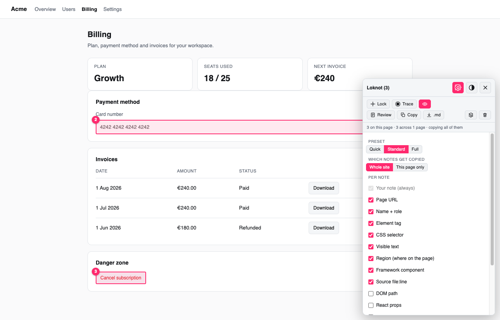

# Loknot — *lock it, note it*

Lock onto elements in the browser, attach notes, copy them all as one prompt for your AI
coding agent. Ships four ways from one dependency-free source file: **Chrome extension**,
**Firefox extension**, **bookmarklet**, **userscript**.


Every noted element keeps an outline and a number on the page. The panel lists them with the
name and selector it resolved. When you are done, **Copy** hands you one markdown prompt that
tells an agent exactly which elements you meant — no screenshots, no "the button near the top".

- Works on **any site** — production, staging, someone else's app, a local dev server
- Notes survive reloads and follow you **across pages and in-app routes**
- Captures the **accessible name, role, region, selector, component and source file**
- **Trace** records the backend calls an interaction actually fires
- Nothing leaves the browser — no account, no network calls, no analytics

```
node icons.js && node build.js
open dist/install.html
```

**Just want to use it?** `INSTALL.md` has the three install paths, no build required.

## Install

| Target | How |
|---|---|
| **Chrome** | `chrome://extensions` → Developer mode → **Load unpacked** → `dist/extension-chrome` |
| **Firefox** | `about:debugging#/runtime/this-firefox` → **Load Temporary Add-on** → `dist/extension-firefox/manifest.json` |
| **Bookmarklet** | `open dist/install.html`, drag the pink button to the bookmarks bar |
| **Userscript** | Tampermonkey / Violentmonkey → paste `dist/loknot.user.js` |

`file://` pages need "Allow access to file URLs" enabled on the extension's details page.

## Keys

| Key | Action |
|---|---|
| `⌘/Ctrl+Shift+L` | lock on / off (enter or leave selector mode) |
| **Trace** button | 3-2-1 countdown, then use the app normally while calls are recorded |
| `⌘/Ctrl+Enter` | save the note (or copy, from the review pane) |
| `Esc` | leave selector mode / cancel / close review |
| `×` | unload |

`⌘+Shift+L` is unbound in Chrome and Firefox on every platform. Deliberately avoided:
`⌘+Shift+P` (Firefox private window), `⌘+Shift+N` (Chrome incognito), `⌘+Shift+C/J/K`
(devtools). Rebind it any time at `chrome://extensions/shortcuts`.

## Panel

Two grouped rows, every button icon + label:

```
header  ⚙ settings   ◐ theme   ✕ unload
row 1   ✛ Lock       ⏺ Trace   👁        what you do on the page
row 2   ▤ Review     ⧉ Copy    ⭳ .md   ·   ≡ Pages   🗑 Clear
```

- **Lock** — selector mode. Hover highlights, click locks onto that element and opens the
  note box. The button stays filled while it is armed.


- **Review & edit** — opens as a rendered **markdown preview**. Click the text (or **Edit**)
  to switch to the raw box, type extra context, hit **Preview** to read it back. **Copy**
  always takes what is in the box. **Reset to notes** rebuilds the text from the saved
  notes and discards anything you typed.
- **Copy / .md** — clipboard, or a downloaded file.
- **Scope** lives in Settings and defaults to **Whole site** — Copy takes everything you
  collected across the site, grouped under a heading per page. Switch it to *This page only*
  when you want a narrower prompt. The subtitle always states which is active:
  `3 on this page · 12 across 5 pages · copying all of them`.
- **Pages** — every page you have notes on, with counts. Click a row to jump there.
- **Overlay** — one switch for the outlines *and* the numbers. Off means a clean page.
  Hover a badge for the note and the element's name; click it to scroll there. An element
  that has since disappeared is drawn dashed at its last known position. Toggle is remembered.
- **Theme** (header) — sun / moon / half-disc icon cycles light → dark → auto. Remembered.
- **Clear** — asks in a Loknot dialog, never a browser `confirm()` box.
- Click any note in the list to rewrite it in place.

## Cross-page capture

Notes are keyed per page under one origin, so you click through the app and keep noting.
Every page you return to redraws its own outlines and numbered badges, numbered exactly
as the panel lists them. **Pages** lists all of them;
**Site** scope exports the lot as one prompt, grouped under a markdown link per page.

Two kinds of navigation, and they behave differently:

| Navigation | Overlays |
|---|---|
| **In-app route change** (`pushState`, back/forward, hash) — most dashboards, Supabase Studio, any React/Vue router | **Automatic.** Loknot watches history, re-keys to the new route and draws that route's overlays as you land. A `MutationObserver` re-anchors the boxes while the app re-renders |
| **Full page load** (hard reload, a real link, a new tab) | The page's JavaScript is destroyed, so Loknot goes with it. Press the hotkey again — or turn on follow mode below |

**Follow mode** brings it back by itself after a full load. Right-click anywhere (or the
Loknot icon) → **"Loknot: keep overlays across page loads"** → Allow. That grants the site
access re-injection needs; the tab then stays in a capture session until you close Loknot
with the **×** button. Equivalent manual route: right-click the icon → *This can read and
change site data* → *On all sites*.

A page is keyed by path **plus** meaningful query (`?view=billing` is its own page;
`utm_*`, `gclid`, `fbclid` and friends are ignored so one page never splits into many).

## Backend context

Loknot patches `fetch`, `XMLHttpRequest` and `WebSocket` the moment it loads and keeps a
rolling buffer of the last 200 calls. Requests made *before* it loaded are still recovered
from `performance.getEntriesByType('resource')` — endpoints only, no bodies.

- **Every note** automatically carries the calls from the 15 seconds before it was written.


- **Trace** (toolbar) answers *"what does this button actually call?"*:
  1. Press it. A **3 · 2 · 1 · GO** countdown runs on the page.
  2. Use the app for real — clicks are never swallowed. A red **Recording · 3s · 5 call(s)**
     chip sits at the top of the screen and the toolbar button becomes **Stop ●**.
  3. Stop with the chip's button, the toolbar button, `⌘/Ctrl+Shift+L`, or `Esc`.
  4. The note box opens on the last element you clicked, carrying every call recorded in
     between. If you did not click anything, Loknot drops into pick mode holding the calls.

Per call it records method, path with query, status, duration, host, request-body shape
(JSON keys, GraphQL operation name, FormData fields) and response shape (`array[24] of
{id, email, created_at}`), plus a named service:

| URL shape | Reported as |
|---|---|
| `/rest/v1/rpc/delete_user` | **Supabase RPC delete_user()** |
| `/rest/v1/users?select=id,email` | **Supabase table "users" select=id,email** |
| `/auth/v1/token`, `/storage/v1/object/...`, `/functions/v1/...` | **Supabase Auth / Storage / Edge Function** |
| any `/graphql` | **GraphQL &lt;operationName&gt;** |
| `/api/...`, `/v1/...` | **API POST /api/audit** |
| another host | **third party &lt;host&gt;** |
| `new WebSocket(...)` | logged on open — this is how Supabase Realtime shows up |

On React it also reads the element's props and the source of its `on*` handlers, which is
often where the call is written:

```
- **Props:** `onClick`, `disabled`, `variant`
- **Handler onClick:** `async () => { await supabase.from('users').delete().eq('id', id) }`
```

Nothing is sent anywhere — the buffer lives in the page and dies with it.

## Settings — what goes into the prompt



Gear button in the panel header. Presets, then a checkbox per field, then a live size
estimate so you can see what each field costs before copying.

| Preset | Fields |
|---|---|
| **Quick** | note · page · name+role · element tag · **selector** |
| **Standard** *(default)* | + visible text · region · framework component · source file |
| **Full** | + DOM path · React props · handler source · backend calls · position/size |

Touching any checkbox flips the label to **Custom**. The choice is stored in
`loknot::fields` and applies to Copy, `.md` and the preview alike.

**Environment** is its own switch, off by default, and emits **one** line per export —
never repeated per note:

```markdown
**Environment:** Chrome 151 · macOS · desktop · viewport 1728×847 @2x
· screen 3456×2234 · Europe/Amsterdam · Thu Sep 03 2026 14:22:07
```

Each note is headed by the element it points at, numbered in click order so it still ties
to badge ③ on the page and to the row in the panel:

```markdown
### 3. "Delete user" (button)
- **Note:** Needs a confirm dialog
- **Page:** https://app.example.com/users
- **Name:** "Delete user" — button (from visible text)
- **Element:** `<button data-testid="del-user">`
```

## What each note carries

- the note text, and the **page URL** it was taken on (also a markdown link header per page)
- the element's **human name and role** — `"Save billing details" — button` — resolved the way
  a screen reader would: `aria-label` → `aria-labelledby` → `<label for>` → wrapping `<label>`
  → `title`/`alt`/`placeholder`/`name` → visible text → inner heading → `data-testid`
- the **region** it sits in, in words: `main › Billing (section) › form`
- a **unique CSS selector** (id → `data-testid` → class + `nth-of-type` path)
- a readable **DOM path**: `body > main > section > form > button`
- the opening tag with its useful attributes, plus the element's visible text
- **React/Vue component name** and, on a dev build, **`src/File.tsx:42`** — read from the
  React fiber `_debugSource` / Vue `__file`. This is what lets an agent jump straight to the source.
- viewport box

Notes live in `localStorage` under `loknot::<origin><path>`, so a reload keeps them.
Nothing leaves the browser.

## Console API

`__loknot.markdown()` · `.copy()` · `.review()` · `.togglePick()` · `.theme('dark')` · `.notes` · `.destroy()`

## Files

| File | Role |
|---|---|
| `loknot.js` | the whole tool — one IIFE, shadow-DOM UI, zero dependencies |
| `build.js` | emits everything under `dist/` |
| `icons.js` | renders the PNG icon set (no deps) |

## Releasing

Source lives in git; built packages live on the GitHub release. `dist/` is never committed.

```bash
# 1. bump VERSION in build.js   (AMO rejects a version it has already seen)
# 2. commit, tag, push
git commit -am "Loknot 1.3.3"
git tag v1.3.3
git push origin main --tags
```

The tag fires `.github/workflows/release.yml`, which builds, checks the tag against the
manifest version, has Mozilla sign the Firefox build, and attaches to the release:

- `extension-firefox-v<version>.zip` and the signed `<hash>-<version>.xpi`
- `extension-chrome-v<version>.zip` — what you upload to the Chrome Web Store
- `SHA256SUMS.txt`

Signing in CI needs two repository secrets, **`AMO_JWT_ISSUER`** and **`AMO_JWT_SECRET`**
(Settings → Secrets and variables → Actions). Without them the workflow still builds and
publishes the zips, it just skips signing.

Locally: `npm run build`, `npm run watch`, `npm run sign:firefox`.


## License

MIT — see `LICENSE`.
