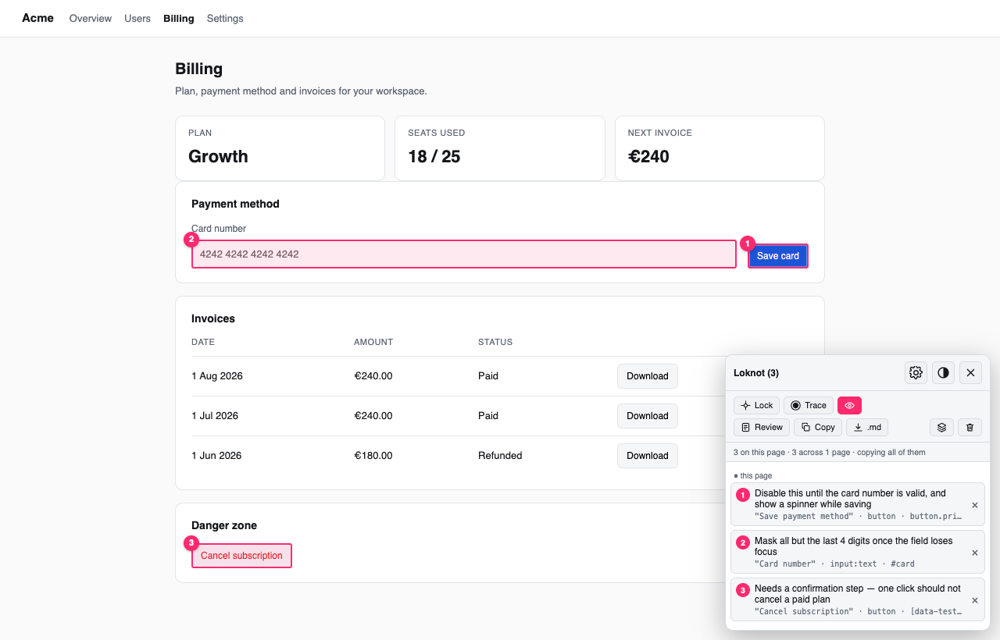
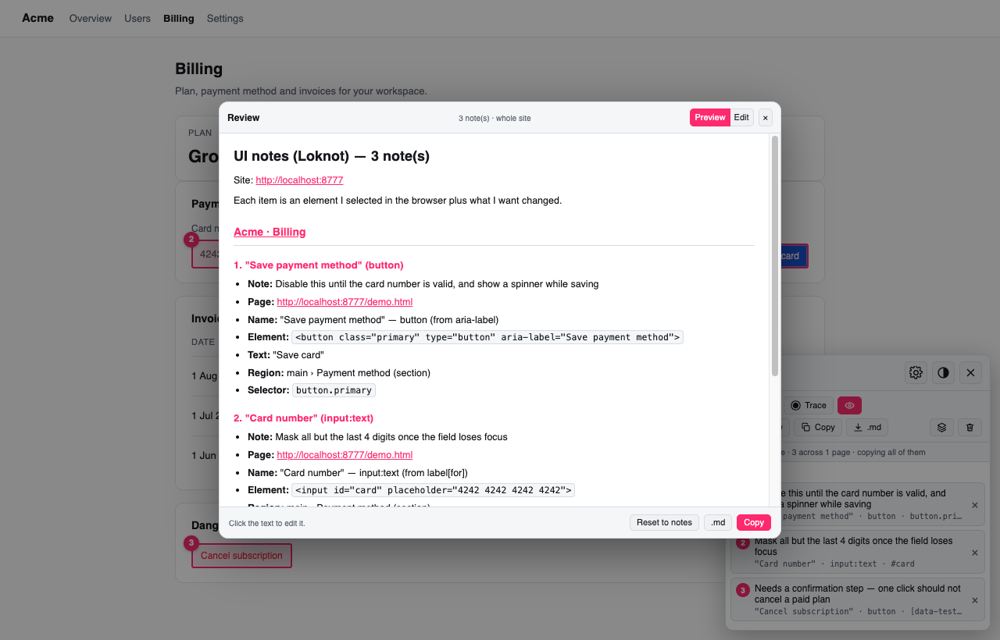
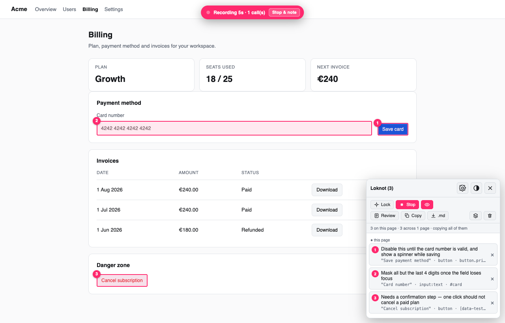

# Loknot — *lock it, note it*

Lock onto any element on a web page, write one line about it, and copy every note you made
as a single precise prompt for your AI coding agent.



## What it does

- **Point instead of describing.** Click the element, type one line. No more *"the blue save
  button in the billing card, not the download ones…"*
- **Carries the targeting for you** — the element's accessible name and role, where it sits on
  the page, a unique CSS selector, the React/Vue component and source file where available.
- **Shows what the button actually calls.** Trace records the network requests an interaction
  fires and names the service: Supabase table, RPC, Auth, Storage, GraphQL, REST route.
- **Collects across pages.** Notes survive reloads and follow you through the app; copy them
  all as one prompt.
- **Nothing leaves the browser.** No account, no server, no analytics.



## Install

| Browser | Download | Then |
|---|---|---|
| **Firefox** | [loknot-firefox-1.3.3.xpi](https://github.com/markoladika/loknot/releases/latest/download/loknot-firefox-1.3.3.xpi) | `about:addons` → ⚙ → **Install Add-on From File…** |
| **Chrome** | [loknot-chrome-1.3.3.zip](https://github.com/markoladika/loknot/releases/latest/download/loknot-chrome-1.3.3.zip) | unzip → `chrome://extensions` → **Developer mode** → **Load unpacked** → pick the folder |
| **Any** | [loknot-bookmarklet.html](https://github.com/markoladika/loknot/releases/latest/download/loknot-bookmarklet.html) | open it, drag the pink button to your bookmarks bar |

The Firefox build is signed by Mozilla, so it stays installed after a restart.
All files live on the [releases page](../../releases/latest) — not behind the green *Code*
button, which gives source without a build.

Then press <kbd>⌘/Ctrl</kbd>+<kbd>Shift</kbd>+<kbd>L</kbd> on any page.

## Using it

| Key | Action |
|---|---|
| `⌘/Ctrl+Shift+L` | lock on / off |
| click an element | write a note, `⌘/Ctrl+Enter` to save |
| **Copy** | the whole set lands on your clipboard |



Settings choose exactly which fields go into the prompt, with a live token estimate.
`INSTALL.md` has the full install details.

## Build it yourself

```bash
git clone https://github.com/markoladika/loknot.git && cd loknot
node build.js          # → dist/
```

One dependency-free source file, `loknot.js`. MIT licensed.
